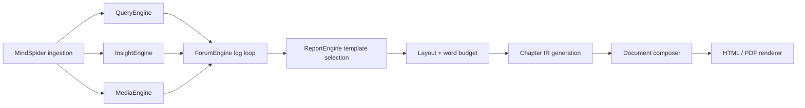

# Architecture

## Observed Facts

- The runtime is centered on `app.py`, which starts database preparation, the three single-engine Streamlit apps, the forum monitor, and the report API.
- `MindSpider/main.py` is the upstream ingestion layer. It coordinates `BroadTopicExtraction` and `DeepSentimentCrawling`, initializes the database, and installs crawler dependencies when needed.
- `QueryEngine`, `InsightEngine`, and `MediaEngine` share the same node layout and state shape, but differ in tool backends: web news search, local database search with sentiment/clustering, and multimodal search.
- `ForumEngine/monitor.py` tails engine logs and writes `forum.log`; `llm_host.py` then converts recent agent speech into a moderator-style response.
- `ReportEngine` is the terminal composition layer. It selects a template, slices it into sections, designs layout, budgets words, generates per-chapter IR, stitches the chapters, and renders HTML/PDF.
- The IR layer in `ReportEngine/ir` defines a strict block vocabulary, including `heading`, `paragraph`, `list`, `table`, `engineQuote`, `callout`, `kpiGrid`, `widget`, `swotTable`, and `pestTable`.

## Inferences

- The architecture is layered rather than monolithic: each engine owns its own analysis semantics, while `ReportEngine` only consumes their outputs.
- The strongest boundary is between analysis and composition. The IR contract and chapter validation make the final report stage behave more like a compiler than a pure generator.
- The file-based forum/log pipeline suggests the system was designed for long-running, inspectable sessions rather than one-shot chat completions.

## Open Questions

- Whether `MindSpider` is always the source of truth for analysis inputs, or whether some report flows can start from preexisting engine outputs.
- How much the HTML renderer depends on chart repair and PDF-specific font handling in production use.
- Whether the Streamlit single-engine apps expose materially different user paths or only different wrappers around the same backend pattern.

## Next Action

If we need a second pass, inspect the remaining engine node files and the HTML/PDF renderer details to map the final dependency edges more precisely.
