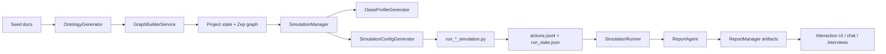

# Architecture

## Observed Facts

- The entrypoint is `backend/run.py`, which boots Flask after validating `LLM_API_KEY` and `ZEP_API_KEY`.
- The app exposes three blueprints: graph, simulation, and report.
- The overall flow is:
  1. upload seed documents
  2. generate ontology
  3. build Zep graph
  4. prepare OASIS profiles and simulation config
  5. run one or both platforms
  6. generate a report
  7. allow follow-up interaction with the report agent or live agents
- The backend persists state to the filesystem rather than a database for projects, simulations, and reports.
- `ProjectManager` persists `project.json`, extracted text, and uploaded source files.
- `SimulationManager` persists `state.json`, generated profiles, and `simulation_config.json`.
- `SimulationRunner` persists `run_state.json`, monitors child processes, and optionally streams actions back into Zep.
- `ReportManager` persists outline, progress, per-section markdown, full report markdown, structured agent logs, and console logs.
- `TaskManager` is a singleton in-memory tracker for async graph-build and report tasks; unlike the other managers, it does not persist task state to disk.
- The live simulation runtime is split into separate Twitter and Reddit scripts, with a parallel runner that can manage both.
- The `/api/simulation/start` API returns as soon as `SimulationRunner.start_simulation()` launches the subprocess; it does not wait for the live environment to become interview-ready.
- In the validated single-platform Twitter path, the environment becomes interview-ready only after an additional warm-up period of roughly 18-20 seconds.
- The single-platform scripts and the parallel runner do not expose the same runtime contract:
  - single-platform mode writes sparse `env_status.json`
  - parallel mode writes richer platform availability fields
  - parallel mode writes per-platform `actions.jsonl`
  - single-platform mode relies mostly on SQLite plus `simulation.log`
- Despite that contract drift, the validated single-platform Twitter path can still complete wait-command startup, accept `interview`, and accept `close-env`.

## Inferences

- The architecture is a staged pipeline with durable checkpoints between phases, which makes it resilient to long-running jobs and UI refreshes.
- Zep serves as the shared semantic memory layer across document ingestion, simulation setup, reporting, and post-run interviews.
- OASIS is the execution engine for the world simulation, while Flask remains the control plane.
- The architecture is best understood as three cooperating planes:
  - control plane: Flask APIs, project/simulation/report managers
  - memory/simulation plane: Zep graph plus OASIS scripts plus optional graph-memory updater
  - research plane: `ReportAgent` and post-report chat
- The filesystem artifacts are the true durable contract. The async task layer is comparatively weaker because it is process-local.
- Runtime behavior is governed by multiple overlapping contracts rather than one canonical state surface:
  - process-launch contract
  - wait-command readiness contract
  - progress-tracking contract
  - durable artifact contract

## Core Flow

## Boundary Notes

- `ProjectManager` owns uploaded files, extracted text, ontology, and graph metadata.
- `SimulationManager` owns profile generation and simulation config generation.
- `SimulationRunner` owns process launch, log parsing, run-state persistence, and IPC command handling.
- `ReportManager` owns report folder layout, section files, progress files, and log retrieval.
- `TaskManager` owns task progress only during the current backend process lifetime.
- `ReportAgent` is the only component that spans both stored graph evidence and live simulation interviews.

## Runtime Contract Map

- `simulation.py:/start`
  - semantic meaning today: child process launched
  - not guaranteed: interview-ready, wait-command ready, round/progress visible
- `env_status.json`
  - semantic meaning today: coarse liveness
  - in parallel mode: also platform availability
  - in single-platform mode: no explicit per-platform availability fields
- `run_state.json`
  - semantic meaning today: backend-facing progress view
  - source of truth today: `SimulationRunner` monitor thread
  - weakness: monitor depends on `actions.jsonl`, which single-platform mode does not emit
- `twitter_simulation.db` / `reddit_simulation.db`
  - semantic meaning today: strongest low-level evidence of what the simulation actually did
  - validated content: sign-up, initial posts, interview traces
- `simulation.log`
  - semantic meaning today: human-readable execution trace
  - validated content: env creation, loop completion, wait-command entry

## Runtime Contract Drift

- The control plane assumes one shared runtime shape, but the implementation actually has two:
  - parallel path with structured action logging and richer status files
  - single-platform path with thinner status files and DB/log-first observability
- This creates a split between "what actually happened" and "what backend monitoring can see".
- In practice, the live Twitter path can be healthy while:
  - `/start` already says `running`
  - `env-status` still says not alive for a short warm-up window
  - `run_state.json` remains at round 0
- The result is not broken simulation logic so much as a leaky runtime contract between scripts and backend observers.

## Architectural Reading

- The graph-building phase is a semantic normalization step. It converts raw uploaded material into a controlled ontology plus a Zep graph.
- The simulation-prep phase is a translation step. It converts graph entities into OASIS-ready personas and time/event/activity parameters.
- The simulation phase is a world-execution step. It produces actions, evolving state, and optionally feeds meaningful activity back into graph memory.
- The report phase is a bounded research step. It does not just summarize artifacts; it performs section-scoped evidence gathering over graph memory and live interviews.

## Risks and Trade-offs

- Durable artifact boundaries make the system observable, but they also spread state across many folders and file formats.
- The design is more restart-friendly for finished artifacts than for in-flight async tasks.
- The report layer is powerful because it can reach into both graph memory and the live environment, but that also makes it the most integration-heavy part of the system.
- The architecture is stronger at doing the work than at reporting its readiness consistently.
- The parallel runtime appears to be closer to the backend's intended contract than the single-platform runtime.

## Open Questions

- Whether the report layer should eventually live on top of a separate retrieval service instead of calling Zep directly.
- Whether the runtime scripts should be treated as part of the backend contract or as implementation detail.
- Whether `TaskManager` should be persisted if this is expected to survive backend restarts cleanly.
- Whether the optional graph-memory updater is intended to be core behavior or an advanced mode.
- Whether single-platform mode should fully conform to the parallel path's `env_status` and `actions.jsonl` contract.
- Whether `/start` should expose a second-stage readiness signal instead of only process-launch success.

## Next Action

- Continue treating single-platform vs parallel runtime semantics as a first-class research topic:
  - compare their readiness contract
  - compare their progress contract
  - decide which surface should be the canonical backend truth
