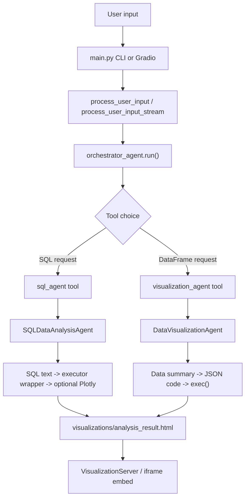

# Architecture

## System Overview

This project has a clear top-level orchestration layer and two specialized execution layers:

- `main.py` is the user-facing entrypoint for both CLI and Gradio UI usage.
- `app/agent_orchestrator.py` is the routing layer that decides which downstream tool or agent to call.
- `app/tools/sql_data_analyst_agent.py` handles SQL generation, SQL execution, and optional Plotly creation for database-backed analysis.
- `app/tools/data_analyst_agent.py` handles DataFrame-to-Plotly visualization generation.
- `app/visualization_server.py` serves the generated HTML visualization for display in the UI.

The architecture is layered, but the agents are not peers in the strong multi-agent sense. The orchestrator owns the request, and the specialized agents act more like delegated execution services.

## Module Breakdown

### `main.py`

- Parses CLI arguments.
- Loads CSV/XLSX files or DB URLs.
- Creates the Gradio chat UI when run without arguments.
- Streams status updates back to the UI, then embeds the generated visualization through the local HTTP server.

### `app/agent_orchestrator.py`

- Defines `OrchestratorDependency` for per-request context.
- Defines `AnalysisResult` as the top-level result contract.
- Creates the PydanticAI orchestrator agent with a routing prompt.
- Registers `sql_agent`, `visualization_agent`, and `determine_data_source` tools.
- Wraps the request flow with `process_user_input`, `run_agent_orchestrator`, and `process_user_input_stream`.

### `app/tools/sql_data_analyst_agent.py`

- Builds a database schema prompt from live SQLAlchemy introspection.
- Generates SQL text with the LLM.
- Generates an executor function for the SQL.
- Executes the SQL directly first, then falls back to the generated function if needed.
- If the request needs visualization, generates Plotly code and executes it.
- Stores intermediate state in `_state`.

### `app/tools/data_analyst_agent.py`

- Summarizes a DataFrame into compact textual context.
- Prompts the model for JSON containing `code` and `explanation`.
- Executes the generated code inside a controlled local namespace.
- Retries code generation when the figure is missing or execution fails.

### `app/visualization_server.py`

- Starts a small HTTP server on an available port.
- Serves saved HTML files so the Gradio UI can embed them in an iframe.

## Execution Flow

The flow is request-scoped and mostly one-way. There is no shared long-lived coordinator state beyond the request dependencies and each agent's local in-memory fields.

## State and Data Flow

- `OrchestratorDependency` carries `user_prompt`, `model`, `data`, `db_connection`, and `usage_limits`.
- `AnalysisResult` returns `success`, `message`, `visualization_path`, `error`, and `data_summary`.
- `SQLDataAnalysisAgent` keeps its own `_state` dict with generated SQL, generated Python function, fetched DataFrame, visualization function, Plotly figure, and error.
- `DataVisualizationAgent` keeps `response`, `visualization_code`, and `plotly_figure`.
- `process_user_input_stream` does not stream model tokens; it wraps a completed agent run in progress messages.
- Gradio `history` is UI state, not agent memory.

## Extensibility

- The orchestrator can route new analysis modes by adding new tools.
- `SQLDataAnalysisAgent` could be extended with safer SQL validation, schema-aware query planning, or a richer visualization stage.
- `DataVisualizationAgent` could be extended with schema validation for the JSON response or AST checks for generated code.
- `visualization_server.py` could be replaced with a static-file route or embedded renderer if the UX changes.

## Trade-offs

- The design is easy to follow and easy to test at the module boundary.
- It is flexible because LLMs can generate both SQL and Plotly code, but that flexibility comes with `exec()` risk and weak runtime guarantees.
- The system uses separate LLM calls for separate tasks, which makes the flow understandable but adds latency and error surface.
- The current routing heuristic is simple and partly prompt-driven; it is not a planner with explicit subtask graphs.

## Open Questions

- Is the `determine_data_source` tool actually used by the model in practice, or is it mostly dead weight?
- Should the visualization server remain a separate HTTP server, or would a direct Gradio/inline rendering path be simpler?
- Is `app/rag/vector_store.py` part of a future architecture, or just an unhooked experiment?

