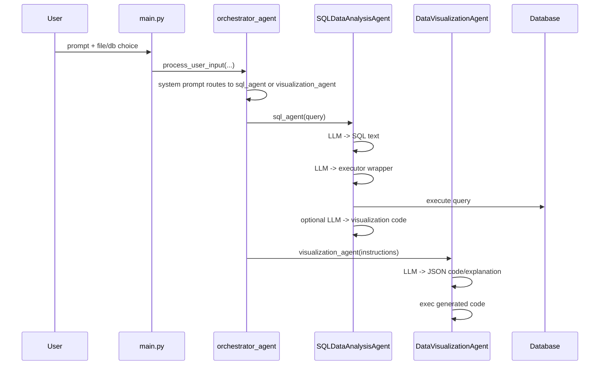

# LLM Orchestration

## LLM Call Map

The project uses multiple LLM calls per request, but the orchestration pattern is still fairly linear.

1. Top-level routing call through `orchestrator_agent.run(...)`
2. SQL branch:
   - generate SQL text
   - generate a Python executor wrapper for that SQL
   - optionally generate Plotly visualization code
3. DataFrame branch:
   - summarize the DataFrame
   - generate JSON with `code` and `explanation`
   - execute the code and retry if needed

The top-level agent returns a structured `AnalysisResult`. The child agents return dict-like state or a response object plus generated code.

## Scheduling Pattern

This is a route-and-delegate tree, not a global planner/executor graph.

- The orchestrator decides whether the request is SQL-shaped or DataFrame-shaped.
- The SQL agent performs its own internal subpipeline.
- The visualization agent performs its own internal prompt -> code -> exec cycle.
- There is no explicit reviewer agent, reflection agent, or multi-branch planning loop.

## Structured Output Strategy

- `orchestrator_agent` uses `result_type=AnalysisResult`, which gives the top level a typed contract.
- `DataVisualizationAgent` asks for JSON with exactly two keys: `code` and `explanation`.
- `SQLDataAnalysisAgent` asks for plain SQL text and plain Python function text.
- The code uses regex extraction to recover from markdown-wrapped outputs.
- The code does not appear to use a schema validator, AST validator, or a dedicated parser for generated code beyond string checks and `try/except`.

## Context Transfer

- The top-level dependency object carries the active user prompt, model handle, data or DB connection, and usage limits.
- SQL context is injected as schema text and then, if visualization is needed, a small sample of the query result.
- DataFrame context is injected as a compact summary of shape, column types, missing values, and a few basic stats.
- The UI history is separate from model memory; it records what the user sees, not a real agent session state.

## Reliability Mechanisms

- The orchestrator uses `UsageLimits` to bound total tokens and requests.
- SQL execution first tries a direct SQLAlchemy execution path, then falls back to generated Python if direct execution fails.
- Visualization generation retries when code execution fails or when no `Figure` is found.
- The UI checks whether visualization HTML exists before trying to serve it.
- Test coverage exists for routing, SQL generation, visualization generation, and basic UI flows.

## Limitations

- `process_user_input_stream` is status streaming, not model-token streaming.
- The model-generated SQL executor and Plotly code are executed with `exec()`, so the safety boundary is weak.
- There is no conversation memory, query rewrite, or self-correction planner that spans multiple user turns.
- Prompt quality and runtime safety are tightly coupled because the code expects the model to produce executable artifacts.
- `determine_data_source` is simple keyword logic and may not matter much if the model already learns the same choice from the system prompt.

## Open Questions

- Does the orchestrator actually call `determine_data_source`, or is the tool mostly decorative?
- How often do the direct SQL fallback and visualization retry paths matter in practice?
- Would a stricter output schema reduce execution failures more effectively than the current regex-and-retry approach?

