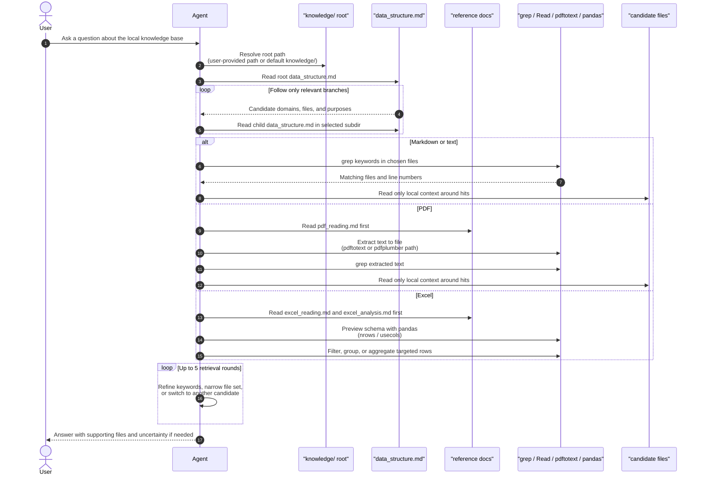

# rag-skill

## Project Summary

`rag-skill` is a documentation-first local knowledge retrieval demo for agents. Its core design is not a vector index or retrieval service. Instead, it combines a skill file, manually maintained `data_structure.md` index files, and format-specific reference docs so the agent can navigate a local knowledge directory and choose the right file-handling workflow before answering.

## Quick Classification

- Style: prompt-governed local knowledge-base retrieval skill
- Best fit: small to medium file-backed knowledge bases with mixed Markdown, PDF, and Excel assets
- Deep research behavior: limited; it supports iterative retrieval, but not planning, decomposition, or multi-role orchestration

## Key Files

- `examples/rag-skill/.agent/skills/rag-skill/SKILL.md`
- `examples/rag-skill/.agent/skills/rag-skill/references/pdf_reading.md`
- `examples/rag-skill/.agent/skills/rag-skill/references/excel_reading.md`
- `examples/rag-skill/.agent/skills/rag-skill/references/excel_analysis.md`
- `examples/rag-skill/.agent/skills/rag-skill/scripts/convert_pdf_to_images.py`
- `examples/rag-skill/README.md`
- `examples/rag-skill/knowledge/data_structure.md`
- `examples/rag-skill/knowledge/AI Knowledge/data_structure.md`
- `examples/rag-skill/knowledge/E-commerce Data/data_structure.md`
- `examples/rag-skill/knowledge/Financial Report Data/data_structure.md`
- `examples/rag-skill/knowledge/Safety Knowledge/data_structure.md`
- `docs/research/projects/rag-skill/notes.md`

## Current Status

The repository still reads more like a reusable skill kit plus sample corpus than like a standalone RAG application, but this round now includes a small live validation pass. I manually walked one Markdown query, one PDF query, and one Excel query against the checked-out sample knowledge base. The workflow shape mostly holds, but the live pass also exposed two important weaknesses: the PDF path assumes tools that are not actually available in this environment, and the safety index overstates what the `XSS.md` file can support.

## Current Research Themes

- prompt-enforced retrieval workflows over the local file system
- manually curated directory indexes as retrieval metadata
- mandatory tool-learning steps before PDF and Excel handling
- where "workflow RAG" diverges from embedding-based or vector-store RAG

## Key Research Questions

- How much of the skill's accuracy depends on the quality and freshness of `data_structure.md`?
- Do agents reliably obey the mandatory "read references first" rule in live runs?
- When does this pattern stop scaling and need a stronger retrieval layer than grep plus local previews?
- Should preprocessed artifacts such as extracted `.txt` files be treated as first-class indexed files instead of incidental helpers?

## Next Action

- Verify the same three file-type flows through an actual agent session that invokes the skill end-to-end, then compare that trace with the manual validation below.

## Research Notes

- [`notes.md`](/Users/uynil/projects/agents/docs/research/projects/rag-skill/notes.md)

## Live Validation Snapshot

### Markdown Query

Query used: `XSS 攻击的防护措施有哪些？`

- The index path worked as expected:
  - root `knowledge/data_structure.md` pointed to `Safety Knowledge/`
  - `Safety Knowledge/data_structure.md` pointed to `XSS.md`
- The content path was weak:
  - `XSS.md` explains the attack categories and payload ideas well
  - but it does not contain a complete defense section
  - the strongest directly retrievable defense-related point in the file is `HttpOnly` for reducing cookie theft risk
- This means the documented retrieval workflow succeeded structurally, but the corpus could not fully support the user question.

### PDF Query

Query used: `2026年 AI Agent 技术有哪些关键发展趋势？`

- The index path worked as expected:
  - root `knowledge/data_structure.md` routed to `AI Knowledge/`
  - `AI Knowledge/data_structure.md` clearly highlighted `2026年AI Agent智能体技术发展报告.pdf`
- The pre-read gate was followed:
  - `pdf_reading.md` was reviewed first
- The documented extraction tools were not available in this environment:
  - `pdftotext` was not installed
  - `pdfplumber` and `pypdf` were also unavailable
- A local fallback using `fitz` (PyMuPDF) was able to extract the report into `/tmp/rag_skill_ai_agent_2026.txt`
  - extracted size: 85 pages, about 188 KB of text
- The extracted text supports several concrete trend points:
  - multi-agent systems becoming a mainstream pattern
  - MCP and A2A becoming interoperability foundations
  - reflection/self-critique becoming a stronger reasoning loop
  - memory as a first-class module, including short-term context and long-term RAG-backed memory
  - future-direction framing around more general agents, embodied AI, edge agents, agent internet, and deeper human-agent collaboration

### Excel Query

Query used: `帮我分析一下库存数据，哪些商品库存不足？`

- The index path worked as expected:
  - root `knowledge/data_structure.md` routed to `E-commerce Data/`
  - `E-commerce Data/data_structure.md` pointed to `inventory.xlsx`
- The pre-read gate was followed:
  - `excel_reading.md` and `excel_analysis.md` were reviewed first
- The workbook path was robust in practice:
  - one sheet: `inventory`
  - columns are explicit and analysis-friendly:
    - `sku`
    - `product`
    - `category`
    - `warehouse`
    - `stock_on_hand`
    - `reorder_level`
    - `unit_cost`
    - `last_restock_date`
- Using the explainable rule `stock_on_hand <= reorder_level`, the file contains:
  - 200 total rows
  - 33 low-stock rows
- The worst shortages by gap are concentrated in rows like:
  - `SKU-0069 儿童绘本 深圳仓 63 / 185`
  - `SKU-0070 移动硬盘 广州仓 70 / 190`
  - `SKU-0071 路由器 成都仓 77 / 195`
- The low-stock rows are spread across all warehouses, with the highest counts in `上海仓`、`武汉仓`、`深圳仓`

## Execution Sequence

The main runtime idea is: navigate the corpus by index docs first, learn file-type handling rules second, and only then do targeted retrieval.

## Observed Facts

- The core skill is named `kb-retriever`, not `rag-skill`, and its description frames the system as a local knowledge-base retrieval assistant that combines `grep`, `Read`, `pdfplumber`, and `pandas`.
- The skill assumes a default knowledge root at `knowledge/`, but allows a user-specified path override.
- The root-resolution rules explicitly forbid using Glob to determine whether `knowledge/` exists; they require a shell directory check such as `test -d`.
- Retrieval is organized around a hierarchy of `data_structure.md` files rather than an automatically built index.
- Before handling PDF files, the skill requires reading `references/pdf_reading.md`.
- Before handling Excel files, the skill requires reading both `references/excel_reading.md` and `references/excel_analysis.md`.
- The public retrieval loop is capped at 5 rounds.
- The repo tree contains no application runtime entrypoint or obvious infra files such as `pyproject.toml`, `requirements.txt`, `package.json`, `Dockerfile`, or a backend/frontend app directory.
- A repo-wide search did not surface embedding, vector store, FAISS, Chroma, Milvus, BM25, reranking, or similar retrieval infrastructure.
- The sample corpus is split into four domains under `knowledge/`: AI reports, financial reports, e-commerce spreadsheets, and safety notes.
- The repository includes `convert_pdf_to_images.py` as a PDF-to-image helper, but the main skill workflow does not reference it directly.
- The checked-out `Financial Report Data` folder contains both PDF files and pre-extracted `.txt` files, while the directory index mainly describes the reports as PDFs.
- The `E-commerce Data` index says the directory is "当前以 CSV 为主", but the actual sample files are `.xlsx`.
- The README claims AI Knowledge contains 14 PDFs and Financial Report Data contains 6 PDFs, but the checked-out sample folders do not match those counts exactly.
- The README advertises performance and accuracy figures, but the repository currently exposes no benchmark, test suite, or evaluation script that validates those numbers.
- In the actual project working directory, `python` and `python3` resolve to different interpreters:
  - `python` -> Conda Python 3.10
  - `python3` -> Homebrew Python 3.11
- In that working directory:
  - `python` has `pandas`, `openpyxl`, and `fitz`
  - `python3` has none of `pandas`, `openpyxl`, `pdfplumber`, `pypdf`, or `fitz`
- `fitz` (PyMuPDF) is available through `python`, and can extract text from the AI Agent PDF into a temporary text file.
- A manual PDF validation against `2026年AI Agent智能体技术发展报告.pdf` successfully retrieved trend-related content about multi-agent systems, MCP/A2A, reflection, and memory.
- A manual Excel validation against `inventory.xlsx` found 1 sheet named `inventory` and 8 explicit columns that are easy to analyze with pandas.
- Using the rule `stock_on_hand <= reorder_level`, the inventory workbook contains 33 low-stock rows out of 200 total rows.
- A manual Markdown validation against `XSS.md` found attack explanation content and `HttpOnly` mentions, but not a complete defense section that would fully answer a protection-focused query.
- `Safety Knowledge/data_structure.md` says `XSS.md` covers defense strategies, but the checked content does not fully support that claim.

## Inferences

- `rag-skill` is better understood as a prompt-governed retrieval protocol over a file system than as a classical RAG stack.
- `data_structure.md` functions as a manual metadata layer: it gives the agent semantic hints about where to look before any direct content search happens.
- The reference docs act like procedural memory modules. They do not hold knowledge-base facts; they hold tool-use instructions that shape how the agent handles file formats.
- Most of the system's practical value likely comes from constraining agent behavior, reducing token blow-up, and avoiding clumsy PDF or Excel handling.
- The design probably works best when the corpus is curated, naming is stable, and humans keep the index files synchronized with reality.
- Drift between README claims, index docs, and real files is already visible in the sample corpus, which suggests maintenance cost is a real weakness of this pattern.
- The presence of pre-extracted `.txt` artifacts hints that operationally useful retrieval may depend on cached preprocessing, but the documentation has not fully promoted those artifacts into the official workflow.
- The Excel path is the most operationally reliable part of the demo because the schema is explicit and the required Python tooling is present.
- The PDF path is conceptually sound but operationally fragile because the documented "recommended" path depends on tools that may not actually exist in the environment.
- The PDF and Excel paths are both sensitive to interpreter alias choice, which means a real agent may succeed or fail based on a shell-default detail that the current skill does not mention.
- The Markdown/text path is only as good as the corpus quality: when the index says a file covers defensive guidance but the file mostly explains attack mechanics, the retrieval workflow cannot compensate.

## Open Questions

- In a live run, does the agent actually follow the mandatory pre-read references, or is that only a documented ideal path?
- How often would index drift cause the agent to choose the wrong branch or miss a relevant file?
- Is the 5-round cap sufficient for larger corpora, or does it mostly work because this demo corpus is still small?
- Should the workflow explicitly prefer cached `.txt` extraction outputs when they already exist?
- Is `convert_pdf_to_images.py` intended for OCR fallback, and if so, why is it not integrated into the main PDF workflow?
- Should the PDF guide document a fallback extraction path for environments where `pdftotext`, `pdfplumber`, and `pypdf` are all missing but another local library is present?
- Should the skill explicitly probe `python` vs `python3` before attempting any Python-based file handling?
- Is the safety corpus incomplete, or was `XSS.md` truncated relative to what the index and README expect?

## Improvement Ideas

- Add a lightweight validation script that checks README counts, domain indexes, and actual files for drift.
- Promote extracted `.txt` artifacts into the documented retrieval path when they exist, instead of treating them as incidental side files.
- Document an OCR fallback path that explicitly connects `convert_pdf_to_images.py` to the PDF handling guide.
- Add one minimal evaluation harness with a few fixed queries so the README's efficiency and accuracy claims have visible evidence.
- Clarify in the README that this is a local retrieval skill demo, not a vector-store RAG service, to reduce architectural ambiguity.

## Blocked or Low-Confidence Record

- Files Checked: `examples/rag-skill/README.md`, `examples/rag-skill/.agent/skills/rag-skill/SKILL.md`, `examples/rag-skill/.agent/skills/rag-skill/references/pdf_reading.md`, `examples/rag-skill/.agent/skills/rag-skill/references/excel_reading.md`, `examples/rag-skill/.agent/skills/rag-skill/references/excel_analysis.md`, `examples/rag-skill/.agent/skills/rag-skill/scripts/convert_pdf_to_images.py`, `examples/rag-skill/knowledge/data_structure.md`, `examples/rag-skill/knowledge/AI Knowledge/data_structure.md`, `examples/rag-skill/knowledge/E-commerce Data/data_structure.md`, `examples/rag-skill/knowledge/Financial Report Data/data_structure.md`, `examples/rag-skill/knowledge/Safety Knowledge/data_structure.md`
- Current Blocker: the current live validation is still a manual simulation of the workflow, not an end-to-end agent run invoking the skill in context
- Working Hypothesis: this project is a useful example of documentation-first local retrieval behavior shaping; its workflow is real enough to work on structured and well-curated files, but it is sensitive to environment gaps and index drift
- Resume From: run the same three queries through an actual agent invocation of the skill, then compare whether the agent obeys the pre-read steps and how it handles the missing PDF tools without manual steering
